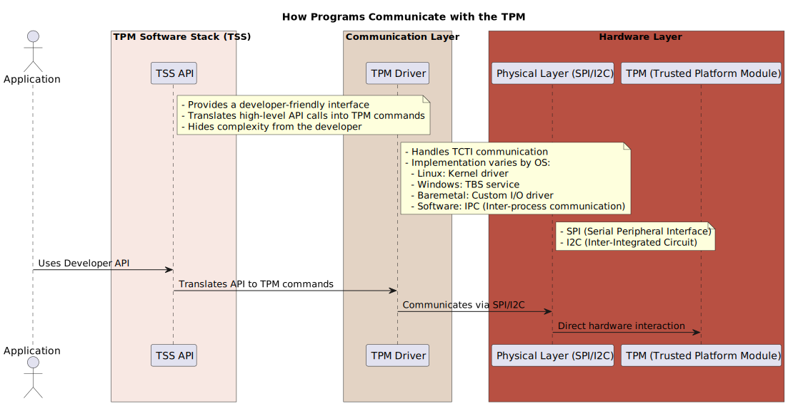
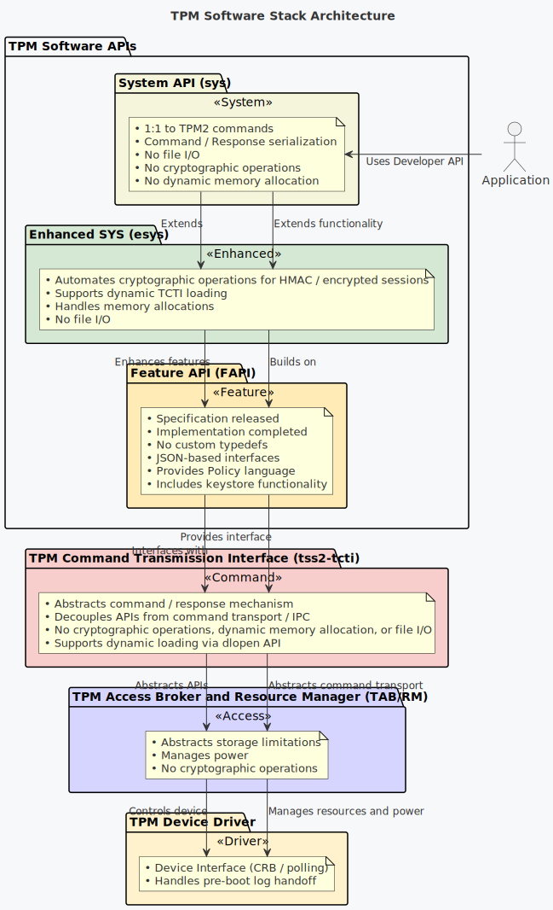

# Enhanced System API (ESAPI)

ESAPI of the tpm2-tss (TPM 2.0 Software Stack)

#### Discussion:  
> In rich OS environments it is unlikely to use **SAPI as it requires extra manual steps and computation to enable the TPM's built-in MITM protection**. Thus, ESAPI is the preferred choice for Rich OS like Windows & Linux, and desktop and server applications (also go-tpm is great for server side application but it does not comply with the SAPI/ESAPI/FAPI TCG definition). <br><br>
> [Virtual vTPM Proxy Driver for Linux Containers](https://www.kernel.org/doc/html/latest/security/tpm/tpm_vtpm_proxy.html)


#### How do programs talk to the TPM?
--> It mainly requires a communication driver and a TPM software stack (TSS)

<p align="center">
  
</p>

When using a TPM Software Stack (TSS) to communicate with a TPM, TSS API calls are issued by the developer. The TSS then translates these API calls into TPM commands, which are forwarded to the TPM Command Transmission Interface (TCTI). This process is abstracted from the developer by the TSS, which simplifies interaction with the TPM.

The TSS still requires specific drivers to send these commands to the actual TPM, depending on the operating system and TPM configuration. The handling of these commands is managed as follows:

* Linux: Kernel driver
* Windows: TBS (Trusted Platform Module Base Services) service
* Baremetal: Custom I/O driver
* Software: IPC (Inter-process communication)
  
<br>

___
<br>

<p align="center">
  
</p>


#### Why ESAPI over SAPI?

* SAPI (System API) provides low-level marshaling/unmarshalling for TPM commands and responses, requiring developers to manually manage cryptographic operations when creating TPM sessions.
  
* ESAPI (Enhanced System API) builds on top of SAPI, automatically tracking TPM object metadata and managing session authorizations and encryption calculations, simplifying session handling.
  
* While SAPI provides more granular control, ESAPI abstracts much of the complexity, automating tasks like session encryption and authorizations.
  
* FAPI (Feature API) further abstracts TPM interactions but at the cost of reduced control, as it uses default flags and settings. It also introduces a policy definition language in JSON for easier management of TPM policies.  
<br>

> <span style="color:#B9A0DC">**Raj:**</span> "So, Howard, what's the deal with this whole ESAPI and TPM thing?"<br><br>
> <span style="color:#DD4124">**Howard:**</span> "Oh, it’s simple. SAPI is like that nerdy guy at the bar, sweating buckets, trying to figure out what to say. Meanwhile, ESAPI walks in, cool as a cucumber, slides up to TPM and goes, ‘Hey, baby, I’ve already got your encryption handled. You need session authorization? I got you.’ TPM’s all like, ‘Where have you been all my life?’"<br><br>
> <span style="color:#B9A0DC">**Raj:**</span> "So, ESAPI’s basically the smooth operator?"<br><br>
> <span style="color:#DD4124">**Howard:**</span> "Exactly. SAPI fumbles, stumbles, and somehow locks itself out. But ESAPI? It’s got TPM wrapped around its little... byte."<br><br>
> <span style="color:#88B04B">**Leonard:**</span> "So, it's like you versus Sheldon with women?"<br><br>
> <span style="color:#DD4124">**Howard:**</span> "No, no, no—I'm ESAPI, Sheldon’s SAPI. He’s still trying to figure out what cryptography even is while I'm already running encryption like it’s date night at the Cheesecake Factory!"<br><br>
> <span style="color:#6A8AB0">**Sheldon:**</span> "I find that metaphor highly inaccurate, yet oddly complimentary. Proceed."

<div style="display: flex; justify-content: space-between; background: transparent; padding: 0; margin: 0;">
    <iframe src="https://giphy.com/embed/KAS81mpeo9kkw" width="350" height="253" style="border:0; background: transparent;" class="giphy-embed" allowFullScreen></iframe>
    <iframe src="https://giphy.com/embed/1xVfByxByNvUiclzzL" width="330" height="330" style="border:0; background: transparent;" class="giphy-embed" allowFullScreen></iframe>
</div>

<!-- 
```plantuml
@startuml
title How Programs Communicate with the TPM

actor "Application" as App

box "TPM Software Stack (TSS)" #F8E8E3
  participant "TSS API" as TSS
  note right of TSS
    - Provides a developer-friendly interface
    - Translates high-level API calls into TPM commands
    - Hides complexity from the developer
  end note
end box

box "Communication Layer" #E3D3C4
  participant "TPM Driver" as TPMDriver
  note right of TPMDriver
    - Handles TCTI communication
    - Implementation varies by OS:
      - Linux: Kernel driver
      - Windows: TBS service
      - Baremetal: Custom I/O driver
      - Software: IPC (Inter-process communication)
  end note
end box

box "Hardware Layer" #B85042
  participant "Physical Layer (SPI/I2C)" as PhysicalLayer
  participant "TPM (Trusted Platform Module)" as TPM
  note right of PhysicalLayer
    - SPI (Serial Peripheral Interface)
    - I2C (Inter-Integrated Circuit)
  end note
end box

App -> TSS : Uses Developer API
TSS -> TPMDriver : Translates API to TPM commands
TPMDriver -> PhysicalLayer : Communicates via SPI/I2C
PhysicalLayer -> TPM : Direct hardware interaction

@enduml
``` -->


