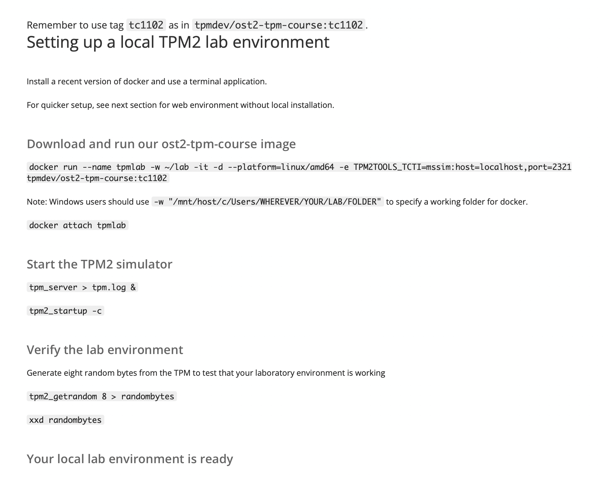
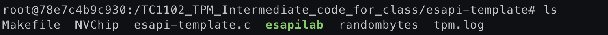
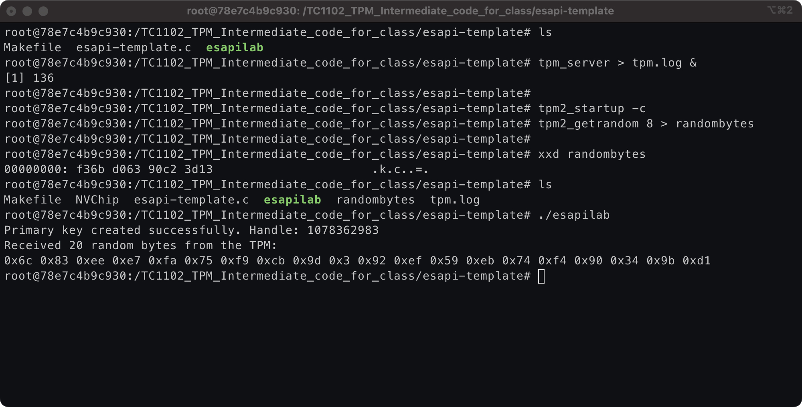

# Primary key generation using ESAPI


### 1. Initialize the ESAPI Context
Ensure the ESAPI context is initialized before any TPM operations.

```c
ESYS_CONTEXT *context;
TSS2_RC rc = Esys_Initialize(&context, NULL, NULL);
if (rc != TSS2_RC_SUCCESS) {
    // Handle initialization error
}
```

### 2. Set Up the `inSensitive` Structure
The `inSensitive` structure holds the authorization value for the TPM key, usually a password.

```c
TPM2B_SENSITIVE_CREATE inSensitive = {0};
TPM2B_SENSITIVE sensitive = {0};

// Set up authorization value (e.g., password)
sensitive.sensitive.data.size = strlen("your_password");
memcpy(sensitive.sensitive.data.buffer, "your_password", sensitive.sensitive.data.size);

inSensitive.sensitive = sensitive;
```

### 3. Define the `inPublic` Structure
Set the parameters for the TPM key, including key type, hash algorithm, and object attributes.

```c
TPM2B_PUBLIC inPublicEcc = {0};

// Define the key type and parameters
inPublicEcc.publicArea.type = TPM2_ALG_ECC;
inPublicEcc.publicArea.nameAlg = TPM2_ALG_SHA256;

// Set up object attributes (example: signing and encryption key)
inPublicEcc.publicArea.objectAttributes = TPMA_OBJECT_DECRYPT | TPMA_OBJECT_SIGN_ENCRYPT | TPMA_OBJECT_FIXEDTPM | TPMA_OBJECT_FIXEDPARENT | TPMA_OBJECT_SENSITIVEDATAORIGIN;

// Define the ECC parameters
inPublicEcc.publicArea.parameters.eccDetail.symmetric.algorithm = TPM2_ALG_NULL;
inPublicEcc.publicArea.parameters.eccDetail.scheme.scheme = TPM2_ALG_NULL;
inPublicEcc.publicArea.parameters.eccDetail.curveID = TPM2_ECC_NIST_P256;
inPublicEcc.publicArea.parameters.eccDetail.kdf.scheme = TPM2_ALG_NULL;

// Set the size of the X and Y points (ECC specific)
inPublicEcc.publicArea.unique.ecc.x.size = 32; // Example size for NIST P-256
inPublicEcc.publicArea.unique.ecc.y.size = 32;
```

### 4. Set Up Additional Parameters
Prepare any additional parameters required for the key creation.

```c
TPM2B_DATA outsideInfo = {0}; // Arbitrary data for sealing
TPML_PCR_SELECTION creationPCR = {0}; // PCR selection (empty if not used)
```

### 5. Create the Primary Key
Invoke `Esys_CreatePrimary` to create the primary key.

```c
TPM2B_PRIVATE outPrivate = {0};
TPM2B_PUBLIC outPublic = {0};
TPM2B_DATA creationData = {0};
TPM2B_DIGEST creationHash = {0};
TPMT_TK_CREATION creationTicket = {0};
ESYS_TR primaryHandle;

rc = Esys_CreatePrimary(
    context, 
    ESYS_TR_RH_OWNER, 
    ESYS_TR_PASSWORD, 
    ESYS_TR_NONE, 
    ESYS_TR_NONE, 
    &inSensitive, 
    &inPublicEcc, 
    &outsideInfo, 
    &creationPCR, 
    &primaryHandle, 
    &outPublic, 
    &creationData, 
    &creationHash, 
    &creationTicket
);

if (rc != TSS2_RC_SUCCESS) {
    // Handle error
}
```

### 6. Clean Up
Flush the context and release any allocated resources.

```c
rc = Esys_FlushContext(context, primaryHandle);
if (rc != TSS2_RC_SUCCESS) {
    // Handle error
}

Esys_Finalize(&context);
```

### RSA Key Example
For an RSA key, the key creation setup would be similar but with RSA-specific parameters:

```c
TPM2B_PUBLIC inPublicRsa = {0};

// Define the key type and parameters
inPublicRsa.publicArea.type = TPM2_ALG_RSA;
inPublicRsa.publicArea.nameAlg = TPM2_ALG_SHA256;

// Set up object attributes (example: signing and encryption key)
inPublicRsa.publicArea.objectAttributes = TPMA_OBJECT_DECRYPT | TPMA_OBJECT_SIGN_ENCRYPT | TPMA_OBJECT_FIXEDTPM | TPMA_OBJECT_FIXEDPARENT | TPMA_OBJECT_SENSITIVEDATAORIGIN;

// Define RSA parameters
inPublicRsa.publicArea.parameters.rsaDetail.symmetric.algorithm = TPM2_ALG_NULL;
inPublicRsa.publicArea.parameters.rsaDetail.scheme.scheme = TPM2_ALG_NULL;
inPublicRsa.publicArea.parameters.rsaDetail.keyBits = 2048; // Example RSA key size
inPublicRsa.publicArea.parameters.rsaDetail.exponent = 0; // Default exponent
```

### Here's the complete code for primaryKeyGen.c 

```c,runnable
/* 
 * This file is free software; you can redistribute it and/or modify
 * it under the terms of the GNU General Public License as published by
 * the Free Software Foundation; either version 2 of the License, or
 * (at your option) any later version.
 *
 * This file is distributed in the hope that it will be useful,
 * but WITHOUT ANY WARRANTY; without even the implied warranty of
 * MERCHANTABILITY or FITNESS FOR A PARTICULAR PURPOSE.  See the
 * GNU General Public License for more details.
 *
 * You should have received a copy of the GNU General Public License
 * along with this file. If not, see <https://www.gnu.org/licenses/>.
 */

#include <stdlib.h>
#include <stdio.h>
#include <tss2/tss2_esys.h>
#include <tss2/tss2_tctildr.h>
#include <tss2/tss2_tcti.h>

#define RANDOM_BYTES_COUNT 20

int main() {
    TSS2_RC ret;
    TSS2_TCTI_CONTEXT *tcti;

    /* Do not forget to start the TPM simulator before launching this app */
    ret = Tss2_TctiLdr_Initialize("mssim:host=127.0.0.1,port=2321", &tcti);
    if (ret != TSS2_RC_SUCCESS) {
        printf("\nError: Tss2_TctiLdr_Initialize\n");
        return 1;
    }

    /* Initialize the ESAPI context */
    ESYS_CONTEXT *ctx;
    ret = Esys_Initialize(&ctx, tcti, NULL);
    if (ret != TSS2_RC_SUCCESS) {
        printf("\nError: Esys_Initialize\n");
        return 1;
    }

    /* Start TPM */
    ret = Esys_Startup(ctx, TPM2_SU_CLEAR);
    if (ret != TSS2_RC_SUCCESS) {
        printf("\nError: Esys_Startup\n");
        Esys_Finalize(&ctx);
        return 1;
    }

    /* Set up the inSensitive structure */
    TPM2B_SENSITIVE_CREATE inSensitive = {0};
    inSensitive.sensitive.userAuth.size = 0; // No authorization data
    inSensitive.sensitive.data.size = 0;     // No extra data

    /* Set up the inPublic structure */
    TPM2B_PUBLIC inPublic = {0};
    inPublic.publicArea.type = TPM2_ALG_ECC;
    inPublic.publicArea.nameAlg = TPM2_ALG_SHA256;
    inPublic.publicArea.objectAttributes = TPMA_OBJECT_DECRYPT | TPMA_OBJECT_SIGN_ENCRYPT | TPMA_OBJECT_FIXEDTPM | TPMA_OBJECT_FIXEDPARENT | TPMA_OBJECT_SENSITIVEDATAORIGIN;
    inPublic.publicArea.parameters.eccDetail.symmetric.algorithm = TPM2_ALG_NULL;
    inPublic.publicArea.parameters.eccDetail.scheme.scheme = TPM2_ALG_NULL;
    inPublic.publicArea.parameters.eccDetail.curveID = TPM2_ECC_NIST_P256;
    inPublic.publicArea.parameters.eccDetail.kdf.scheme = TPM2_ALG_NULL;

    /* Additional setup */
    TPM2B_DATA outsideInfo = {0}; // Arbitrary data for sealing
    TPML_PCR_SELECTION creationPCR = {0}; // PCR selection (empty if not used)

    TPM2B_PUBLIC *outPublic = NULL;
    TPM2B_CREATION_DATA *creationData = NULL;
    TPM2B_DIGEST *creationHash = NULL;
    TPMT_TK_CREATION *creationTicket = NULL;
    ESYS_TR primaryHandle;

    /* Create the primary key */
    ret = Esys_CreatePrimary(
        ctx,
        ESYS_TR_RH_OWNER,
        ESYS_TR_PASSWORD,
        ESYS_TR_NONE,
        ESYS_TR_NONE,
        &inSensitive,
        &inPublic,
        &outsideInfo,
        &creationPCR,
        &primaryHandle,
        &outPublic,
        &creationData,
        &creationHash,
        &creationTicket
    );

    if (ret != TSS2_RC_SUCCESS) {
        printf("\nError: Esys_CreatePrimary\n");
        Esys_FlushContext(ctx, primaryHandle);
        Esys_Finalize(&ctx);
        return 1;
    }

    printf("Primary key created successfully. Handle: %u\n", primaryHandle);

    /* Get random data */
    TPM2B_DIGEST *random_bytes;
    ret = Esys_GetRandom(ctx, ESYS_TR_NONE, ESYS_TR_NONE, ESYS_TR_NONE,
                       RANDOM_BYTES_COUNT, &random_bytes);

    if (ret != TSS2_RC_SUCCESS) {
        printf("\nError: Esys_GetRandom\n");
        Esys_FlushContext(ctx, primaryHandle);
        Esys_Finalize(&ctx);
        return 1;
    }

    if (random_bytes->size == RANDOM_BYTES_COUNT) {
        printf("Received %u random bytes from the TPM:\n", random_bytes->size);
        for (int i = 0; i < random_bytes->size; i++) {
            printf("0x%x ", random_bytes->buffer[i]);
        }
        printf("\n");
    } else {
        printf("\nInsufficient number of random bytes\n");
        printf("Expected: %u. Available: %u.\n",
                RANDOM_BYTES_COUNT, random_bytes->size);
    }

    /* Clean up */
    Esys_FlushContext(ctx, primaryHandle);
    Esys_Finalize(&ctx);
    return 0;
}
```
### To compile this code, first you will have had to set up the lab.



After the lab has been set, 

* #### Run docker 
```
docker run --platform=linux/amd64 -it -d -e TPM2TOOLS_TCTI=mssim:host=localhost,port=2321 0ffabc
```

* #### Attach the image 

In your it will be the same name you provided when downloading the docker image
```
docker attach tpmlab
```

* #### Start TPM2 Simulator
```
tpm2_startup -c
```
To verify if it's running, run the command `$tpm2_startup -c`

* #### Verifying the lab env 

```
pm2_getrandom 8 > randombytes
```
This command ⬇️
``` 
xxd randombytes
```
  should return you this `00000000: f36b d063 90c2 3d13                      .k.c..=.`

Once you are in the lab server, in the /lab path, you will see these folders, which will be visible only after the local env is able to talk to the docker.<br>


### Now it's time to compile the code

There's already a Makefile in the /lab subpath, 

* ##### Run Makefile

`$make`

* ##### Run executable
  
`./esapilab`

* ##### It should return you a Primary Key

`Which looks something like this`




### References:

* [ESYS_CONTEXT](https://tpm2-tss.readthedocs.io/en/latest/group__esys__int.html#struct_e_s_y_s___c_o_n_t_e_x_t)
  
* [Esys_Initialize()](https://tpm2-tss.readthedocs.io/en/latest/group___e_s_y_s___c_o_n_t_e_x_t.html#gaa48ea7753fd0078f580f9afa7421d583)
  
* [Esys_GetRandom()](https://tpm2-tss.readthedocs.io/en/stable/group___esys___get_random.html)

### TIME TO TAKE A BREATHER
___

