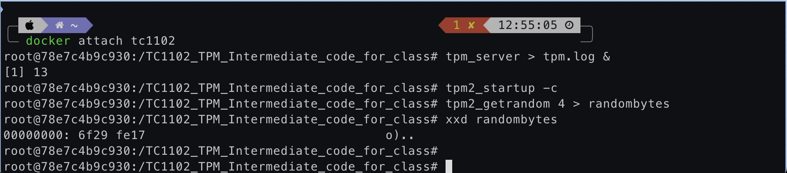

# Trusted Platform Module (TPM)

### Disclaimer: "Before we dive into TPM here's the pre req gloassary, you can come here every time you wanna find something or anything related to TPM, ykwim. Brief Info Only!" 

<div style="width:100%;height:0;padding-bottom:40%; display: block; text-align: center;">
    <iframe src="https://giphy.com/embed/d30oLgYQg8xMNlGE" width="478" height="266" style="border:0;" class="giphy-embed" allowFullScreen></iframe>
</div>

Download and run docker image
```bash
docker run --name tpmlab -w ~/lab -it -d --platform=linux/amd64 -e TPM2TOOLS_TCTI=mssim:host=localhost,port=2321 tpmdev/ost2-tpm-course:tc1102
```
Note: Windows users should use -w "/mnt/host/c/Users/WHEREVER/YOUR/LAB/FOLDER" to specify a working folder for docker.
```bash
docker attach tpmlab
```
Start the TPM2 simulator
```bash
tpm_server > tpm.log &

tpm2_startup -c
```
Verify the lab environment

Generate eight random bytes from the TPM to test that your laboratory environment is working
```bash
tpm2_getrandom 8 > randombytes

xxd randombytes
```
Do not use tag latest (For Beta course only, later the images will be merged into one i.e., @latest)


### Trusted Computing Group Glossary

References: [TCG Glossary](https://trustedcomputinggroup.org/wp-content/uploads/TCG-Glossary-V1.1-Rev-1.0.pdf)

